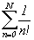

# Grade A

1. Faça um programa que leia dois valores (decimais) representando os catetos de um triângulo retângulo. Calcular e mostrar: a) o valor da hipotenusa, b) a área do triângulo e c) o perímetro do triângulo. Para os cálculos, leve em consideração as seguintes fórmulas: h²=c1²+c2², a=(c1 x c2)/2, p=h+c1+c2.
2. Faça um programa que escreva os números de 0 a 496, com salto variável (incrementado de um): 0, 1, 3, 6, 10, 15, ..., 496.
3. Uma empresa de locação de veículos deseja calcular o valor que precisará desembolsar para encher os tanques de todos os seus veículos que se encontram vazios. A empresa trabalha com dois tipos de veículos: veículos de passeio e veículos off-road. Faça um programa que leia a quantidade de veículos que a empresa possui (de cada categoria), a capacidade em litros dos tanques de gasolina de cada categoria e, por fim, o valor que a locadora paga em Reais por cada galão (americano) de gasolina (considere que um litro de combustível equivale a 0,26417 galão). Após o cálculo, imprima o valor total em Reais a ser desembolsado para encher o tanque de todos os veículos da frota.
4. Uma empresa especializada em cálculo inflacionário e de variação de preços, de Bento Gonçalves, coleta semanalmente o preço de produtos – pré-estabelecidos – em quatro estabelecimentos comerciais do município. Faça um programa para ler os preços apurados, de um dos produtos da lista, nos quatros estabelecimentos e calcular o valor médio do produto. Em seguida, comparar com o valor médio da semana anterior (informado pelo usuário) e escrever: o valor médio da semana anterior, o valor médio da semana atual, se houve inflação (e o percentual), deflação (e o percentual) ou estabilidade de preços. O percentual de variação pode ser obtido através da fórmula: [(valor atual/valor anterior)-1]x100.
5. O número neperiano e, cujo valor é uma constante 2,71828... pode ser obtido por uma aproximação através de uma soma em função de um número de termos N informados pelo usuário.
   - 
   - Somatório de 1/n! variando o valor de n de 0 até N.
   - Nesta expressão, a precisão é determinada pelo valor de N. O valor de n! representa o fatorial de n. Por definição, o fatorial de 0! = 1.
   - Escrever duas funções recursivas fatorial e numeroNeperiano, para determinar o valor de e. Faça um programa que leia o valor de N e imprima o valor aproximado de e utilizando as funções criadas.
   - Por exemplo:
   - Entrada: N = 4
     - e = 1/4! + 1/3! + 1/2! + 1/1! + 1/0!
   - Saída: e = 2,7083333
6. Faça uma função recursiva que receba uma string e retorne a soma de seus dígitos. Por exemplo, “2030678” retornará 26. Para converter um caractere para número, considere que é preciso subtrair 48 do caractere.
